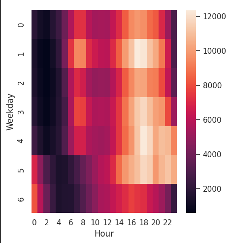
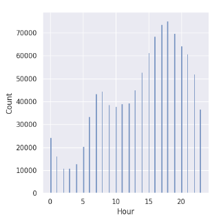
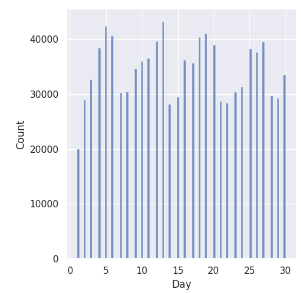
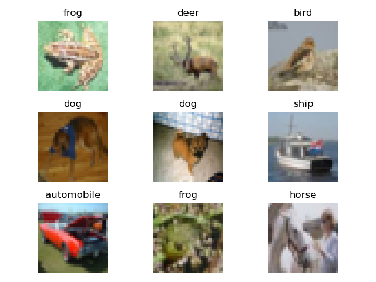
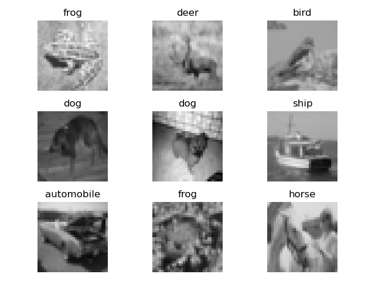

# Small Data Big Dreams
## Intro/Background
Data augmentation and transfer learning have emerged as pivotal techniques in leveraging machine learning, particularly when dealing with small datasets. These techniques effectively mitigate overfitting and enhance model generalizability, working through the artificial expansion of the dataset and the strategic employment of pre-existing knowledge, respectively. This exploration aims to achieve a comprehensive application of these methodologies, along with other key strategies, to address the challenges posed by image classification and tabular regression problems on small datasets.

The implementation starts with feature selection, which involves identifying and focusing on the most relevant attributes in the dataset that significantly contribute to the predictive performance of the model. For tabular regression tasks, we have chosen to use XGBoost, a powerful gradient-boosting framework known for its efficiency and high performance. XGBoost works effectively with tabular data and provides valuable feature importance scores, assisting in our feature selection process.

Subsequently, we turn to data augmentation, an approach that plays a crucial role in counteracting the lack of data. By creating a diverse range of transformations of the original data, we are effectively expanding the dataset and providing the model with more varied scenarios to learn from. This assists in reducing overfitting and in enhancing the model's ability to capture desired properties and invariances.

In parallel, we incorporate data synthesis techniques for generating additional synthetic data that mirrors the properties of the real-world data. We utilize generative adversarial networks (GANs) and diffusion models, renowned for their capacity to create high-quality synthetic data. GANs, which consist of a generator and discriminator network, can learn and mimic the data distribution of the training set. Similarly, diffusion models, specifically the TabDPPM diffusion model, can model the data distribution and generate new synthetic data, thereby providing an additional source of training data.
Finally, for the model, we employ complex models such as a convolutional neural network for image classification tasks, which can effectively handle and extract intricate patterns from image data. By leveraging transfer learning, we aim to utilize these models' pre-trained knowledge and fine-tune them to our specific tasks, thus making efficient use of the limited data.

## Problem Statement
The motivation of this project is to experiment with various dataset sizes and methodologies for data augmentation and transfer learning processes. Overfitting, limited dataset sizes, and overall accuracy in machine learning are still areas rife with potential for new development today, and the ability to artificially expand training sets from existing data offers an efficient breakthrough in the field. Data augmentation holds the promise of a powerful tool, artificially expanding training sets from existing data and thus mitigating overfitting and enhancing model generalizability. However, data augmentation today is still limited by the effectiveness of current approaches. Our goal is not simply to employ the latest models or architectures at the problem at hand, but rather to employ data augmentation, synthetic data generation, and widely used ML models for complex data and to determine the best ensemble approach to contribute meaningful insights and strategies for dealing with the challenge of small datasets. 

## Methods
We are going to explore different ways to deal with small datasets.

### Generative models for data synthesis:
Synthetic data as a supplement to real data is another way to deal with small datasets. Specifically, we will test the GAN and Diffusion models on their efficacy in generating synthetic data.

GAN (Generative Adversarial Networks): GANs consist of two parts: a generator network, which produces synthetic data, and a discriminator network, which tries to distinguish between the real and synthetic data. The two networks are trained together, with the generator network trying to fool the discriminator network, and the discriminator network trying to accurately classify the data as real or synthetic. This adversarial process leads to the generator network producing increasingly realistic data. The reason we believe GANs would work well for data augmentation is due to their ability to learn and mimic the complex distributions of real-world data.
The training process of a GAN can be represented by the following min-max equation:

In this equation:

- E denotes the expectation.

- x is a sample from the real data.

- z is a sample from the noise distribution.

- D(x) is the discriminator's estimate of the probability that real data instance x is real.

- G(z) is the generator's output when given noise z.

- D(G(z)) is the discriminator's estimate of the probability that a fake instance is real.

Diffusion models: Diffusion models are a class of generative models that generate data by simulating a diffusion process, which gradually adds noise to the data until it reaches a predefined noise level. The generated data is then obtained by reversing this process, gradually removing the noise. For tabular data, we will use a specific type of diffusion model called TabDPPM (Tabular Data Pre-training via Predictive Modeling).

The reason we believe diffusion models would work well for tabular regression tasks is due to their ability to model the data distribution in a more granular and step-wise manner, which can capture the intricate structures in tabular data. The diffusion process can be represented by the following stochastic differential equation:

$dx = \sqrt{2D} \, dt \, dW - D \, \nabla_x(\log p(x)) \, dt$

In this equation:

- x is the data.
- D is the diffusion coefficient.
- t is the time.
- W is a Wiener process.
- p(x) is the data distribution.
We will use textual inversion on pre-trained diffusion models to engineer a prompt for our dataset, and use this prompt as a condition to generate synthetic data from the pre-trained diffusion model. The textual inversion process involves finding the most likely latent variables that would have produced a given output, which can be used to guide the generation process.
### Transfer learning: 
We’ll further explore how we can fine-tune existing large models for small dataset classification tasks.
- Changing all parameters of the model is probably unrealistic given our current devices.
- Use LoRA to fine-tune the classification model.
- Add layers on top of the pre-trained model and freeze other layers.
- Use of Big Transfer model for image classification [1].

### Models:

CNN (Convolutional Neural Networks): The convolution operation in a
$\mathrm{CNN}$ is represented by the following equation:

In this equation:
- $I$ is the input image.
- $K$ is the kernel or filter.
- $m, n$ are the spatial coordinates in the input image.
- $h, w$ are the dimensions of the kernel.

XGBoost (Extreme Gradient Boosting): The objective function that
XGBoost optimizes is represented by the following equation:

In this equation:
- $obj(\theta)$ is the objective function to be minimized.
- $L$ is a differentiable convex loss function that measures the difference between the prediction and the target.
- $\Omega(f)$ penalizes the complexity of the model. It is defined as:
$\Omega(f)=\gamma T+\frac{1}{2} \lambda\|w\|^2$, where $\gamma T$ is the complexity control on the number of leaves, and $\frac{1}{2} \lambda\|w\|^2$ is the $L 2$ regularization term on the leaf weights.
- $y$ is the target value.
- $f$ is the predicted value.

LightGBM (Light Gradient Boosting Machine): LightGBM is a gradient-boosting framework that uses tree-based learning algorithms. It is designed to be efficient and contains several advanced features, such as support for categorical features and an option for a histogram-based algorithm for bucketing continuous features.
The objective function that LightGBM optimizes is represented by the following equation:

In this equation:
- $obj(\theta)$ is the objective function to be minimized.
- $L$ is a differentiable convex loss function that measures the difference between the prediction $\left(f\left(x_i\right)\right)$ and the target $\left(y_i\right)$.
- $\Omega(f)$ penalizes the complexity of the model. It is defined as: $\Omega(f)=\gamma T+\frac{1}{2} \lambda\|w\|^2$, where $\gamma T$ is the complexity control on the number of leaves, and $\frac{1}{2} \lambda\|w\|^2$ is the L2 regularization term on the leaf weights.
- $y_i$ is the target value for the $i^{\text {th }}$ instance.
- $f\left(x_i\right)$ is the predicted value for the $i^{\text {th }}$ instance.

## Metrics:

We'll use several metrics to gauge the success of our data augmentation techniques. The Fowlkes-Mallows index gauges the similarity between synthetic and original data, with a higher score signaling better augmentation. The AUC-ROC, an evaluation measure for classification problems, plots the True Positive Rate against the False Positive Rate. We anticipate improved scores with synthetic data. For multi-class models, multiple AUC-ROC curves will be generated. In tabular regression tasks, we'll use RMSE and MAE, metrics that quantify prediction deviations from actual values, thus offering a holistic view of our prediction accuracy. We aim for these scores to also improve with the use of synthetic data [3, 4].
  After the use of data augmentation, we will utilize two main scoring metrics to determine the effectiveness of the synthetic data. First, the Fowlkess-Mallows Measure utilizes the following equation:

  We expect a score between 0 and 1 as well as the FM measure being higher for the data augmented set. 
  The second method that we will use is the “Area Under Curve” of the “Receiver Operating Characteristic” or AUC-ROC. This plots True Positive Rate (TPR) vs False Positive Rate (FPR) where:

  In the AUC-ROC curve, a higher value of X signifies more False positives than True negatives and a higher Y means more True positives than False negatives. The values of the AUC range from 0 to 1, where:
  - 0.7 - 0.8 is acceptable
  - 0.8 - 0.9 is excellent
  - 0.9+ is outstanding [3]

Similarly to the FM measure, we expect the AUC-ROC to be higher for the synthetic dataset. 
  
  When using the AUC-ROC for multi-class models with N number of classes, we will plot N number of AUC-ROC curves. For example, if there are three dog breeds (A, B, and C), then we will have 1 ROC for A classified against B and C, 1 ROC for B against A and C, and 1 ROC for C against A and B.

The RMSE (Root Mean Square Error) is calculated using the following formula:

RMSE = sqrt((1/n) * Σ(yi - y_hat_i)^2)

- n is the total number of observations.
- yi is the actual value for the i-th observation.
- y_hat_i is the predicted value for the i-th observation.

The MAE (Mean Absolute Error) is calculated using the following formula:

MAE = (1/n) * Σ|yi - y_hat_i|

- n is the total number of observations.
- yi is the actual value for the i-th observation.
- y_hat_i is the predicted value for the i-th observation.
- |yi - y_hat_i| is the absolute difference between the actual and predicted values for the i-th observation.

Both RMSE and MAE are measures of prediction error, with RMSE giving a relatively high weight to large errors.
## Results

### Data Cleaning
#### Tabular Data
Inititally, we used the uber dataset. Cleaning the uber dataset involved parsing
through all the data available and removing illfitting data(null data, outliers, irrelevant data).Additionally, only one days worth of data from the uber dataset was
used, this will serve as our training data and the results from the model will be compared to the actual values recorded in the uber dataset. The data was plotted on
scatter plots and a heat map to determine what sort of regression should be used to fit to the data. In the future we will apply the best fit regression model and
begin to train our diffusion model using TabDDPM.The metrics are availible lower in the document. See below for the resulting scatter plots of the cleaned data. Our intitial work on cleaning the uber dataset is shown below, but after more consideration we changed our comparison dataset to the critical superconductor dataset as provided here: https://archive.ics.uci.edu/dataset/464/superconductivty+data. This is due to the dataset being featured as a good dataset for benchmarking due to its 82 features and 21263 rows of data. 

Original Uber Data Visualization:
  

Updated Correlation Heat Map (Superconductor):

LASSO (Superconductor):

PCA (Superconductor):

As can be seen from the feature selection, mean travel time is the most important feature as one would assume. As noted before, this data is not as large as we originally hoped and the relevant features for regression are not vast and so will be updated soon.

#### Image Data
The CIFAR-10 dataset of 60,000 labeled images belonging to 10 different classes is a popular dataset that comes with the PyTorch library. We randomly generated a smaller subset of this dataset, consisting of 1,000 images, in order to account for overfitting mitigation, balanced representation, and overall computational efficiency. 

Random selection helps to ensure that the subset represents the overall distribution of classes in the original dataset. Additionally, cleaning the dataset to a much smaller subset also helps mitigate overfitting by reducing the complexity and redundancy of training data, allowing for further generalizations to larger datasets in the future.  

### Data augmentation:
Data augmentation methods, such as random croppings, rotations, and changing perspectives, are ways to deal with small datasets. We utilized these methods for data augmentation and will work to find which combinations of them are the optimal combo.  
Control Image:
- No augmentation was performed on these images 
   

Random Crop:
- Zooms into and crops a random portion of the image  
   

Grayscale:
- Changes RGB values to shades of gray  
   

Rotations (90, 180, and 270 degrees respectively):  
- This helps the model recognize all sorts of rotated images  
  

Perspective Changes (0.3 and 0.6 respectively):  
- This is used to train the model for stretched and tilted images  
 

### Model

Image: 
We use a Convolutional neural network model to perform image classification. For the model, we use 3 CNN layers with ReLU as an activation function and max-pooling after each layer. After the CNN layers, we use 2 fully connected layers to get the final classification result. For the loss function, we use cross-entropy loss.

The benchmark is the complete dataset of CIFAR10 and the model shows good performance on it:

Tabular:
We used LightGBM and XGBoost due to their tree-based architecture which has shown the most promise for tabular-based data [6]. Based on the results, it can be seen XGboost outperforms LightGBM perhaps due to its split finding algorithm over lightgbm's histogram for data binning, or regularization in the objective function. It should also be noted that lightgbm typically performs better on larger datasets, and since with ~20,000 rows of data one could consider our tabular data as medium-sized, XGBoost could be considered as more suited for our current dataset [7]. From the validation graph we can also conclude that our model is currently not overfitting when trained on 70% of the full data.

  
## Timeline:

## Contribution Table:

| Name            | Contribution                              |
|-----------------|-------------------------------------------|
| Gabe Graves     | XGBoost, GAN, Tabular Feature Seleciton, Updated Intro, Background, Methods |
| Lucy Xing       | Data Cleaning                          |
| Hyuk Lee      | Data Augmentation                     |
| Hannah Huang      | CNN and training                               |
| Rohan Nandakumar| Tabular Preprocessing, Diffusion                      |

## References:
[1] A. Kolesnikov et al., “Big transfer (BIT): General Visual Representation Learning,” Computer Vision – ECCV 2020, pp. 491–507, 2020. doi:10.1007/978-3-030-58558-7_29  
[2] A. Kotelnikov, D. Baranchuk, I. Rubachev, and A. Babenko, "TabDDPM: Modelling Tabular Data with Diffusion Models". doi: https://doi.org/10.48550/arXiv.2209.15421 Focus to learn more  
[3] J. N. Mandrekar, “Receiver operating characteristic curve in diagnostic test assessment,” Journal of Thoracic Oncology, vol. 5, no. 9, pp. 1315–1316, 2010. doi:10.1097/jto.0b013e3181ec173d  
[4] S. Narkhede, “Understanding AUC - roc curve,” Medium, https://towardsdatascience.com/understanding-auc-roc-curve-68b2303cc9c5 (accessed Jun. 16, 2023).   
[5] “Textual inversion,” Textual Inversion, https://huggingface.co/docs/diffusers/training/text_inversion#:~:text=Textual%20Inversion%20is%20a%20technique,model%20variants%20like%20Stable%20Diffusion (accessed Jun. 16, 2023).
[6] L. Grinsztajn, E. Oyallon, G. Varoquaux, "Why do tree-based models still outperform deep learning on tabular data?". doi: 
https://doi.org/10.48550/arXiv.2207.08815
[7] https://neptune.ai/blog/xgboost-vs-lightgbm
